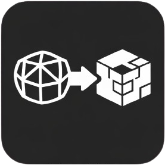

<p align="center">
  
</p>

<h1 align="center">OBJ2MC</h1>

<p align="center">Convert 3D models (.obj) to Minecraft Bedrock geometry (.geo.json)</p>

## Features

- Fast voxelization with SAT (Separating Axis Theorem) for accurate triangle-box intersection
- Greedy meshing optimization — reduces cube count significantly
- Batch conversion — process multiple files at once
- Real-time preview of cube count before conversion
- Multi-language support (EN / RU / JA)
- Clean, minimal UI

## Download

Get the latest release from [Releases](https://github.com/denys-shatin/obj2mc/releases).

## Usage

1. Set voxel scale (higher = more detail, more cubes)
2. Select output folder
3. Add .obj files
4. Click Convert

Output files are saved as `{model_name}.geo.json` — ready to use in Minecraft Bedrock Edition.

## Building from source

### Requirements

- [Rust](https://rustup.rs/)
- [Node.js](https://nodejs.org/) (v18+)
- npm

### Build

```bash
npm install
npm run tauri build
```

Output: `src-tauri/target/release/obj2mc-app.exe`

## Tech Stack

- [Tauri](https://tauri.app/) — desktop app framework
- [Svelte](https://svelte.dev/) — UI
- [Rust](https://www.rust-lang.org/) — voxelization engine
- [glam](https://github.com/bitshifter/glam-rs) — math
- [rayon](https://github.com/rayon-rs/rayon) — parallelization

## Authors

- [denys-shatin](https://github.com/denys-shatin)
- [Aru-san (AshViper)](https://github.com/AshViper)

## License

MIT
